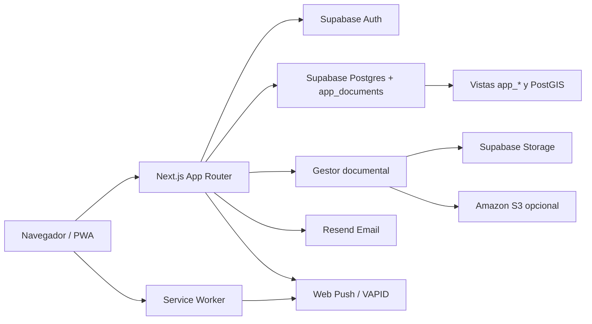

# Pixel Project

Pixel Project es una plataforma web para planificar, ejecutar y auditar proyectos con una mirada integral: tareas, workflows, presupuesto, facturación, inventario, calidad, bitácora, mapas operativos, desempeño del equipo y reportes.

La idea central es simple: cada actividad, costo, activo, interacción y geometría del proyecto es un pixel de información. Cuando esos pixeles se conectan, el proyecto deja de ser una lista de pendientes y se convierte en un sistema vivo de seguimiento.

> Guiño para quien siga construyendo: si algo parece grande, pártelo en pixeles. El producto entero nació así.

## Licencia

Este proyecto se publica bajo licencia MIT. Consulta:

- `LICENSE.md`: texto completo de la licencia MIT.
- `NOTICE.md`: aviso general y notas de redistribución.
- `THIRD_PARTY_NOTICES.md`: créditos de software libre y dependencias.

Para regenerar los avisos de terceros después de cambiar dependencias:

```bash
npm run notices
```

## Componentes principales

- Dashboard personal: resumen de proyectos, tareas asignadas, riesgos, vencimientos y métricas según el rol del usuario.
- Bandeja de entrada: tareas, subtareas, workflows y reuniones asignadas, con calendario personal y gestión de estados.
- Proyectos: centro operativo por proyecto con tabs especializados.
- Tareas y Gantt: tareas por estado, cuantitativas, reuniones, workflows lineales y workflows variables con rutas condicionales.
- Workflow visual: editor fullscreen para construir rutas, pasos, formularios, responsables, condiciones y decisiones.
- Bitácora: historia del proyecto con entradas enriquecidas, reuniones y detección de posibles acciones.
- Calidad: causales, revisiones, devoluciones, aceptación, estadísticas y reportes.
- Rate cards: indicadores de producción, costos e ingresos operativos con reportes y saneamiento manual.
- Presupuesto: líneas macro, piezas presupuestales, calendario mensual, cobertura de personal y conexión con costos operativos.
- Facturación y cobros: ingresos reales, pagos reales y comparación contra presupuesto y operación estimada.
- Inventario: activos por proyecto, hoja de vida, mantenimiento, traslados, bajas, fotos y ubicación.
- Mapa operativo: capas espaciales, PostGIS, simbología, etiquetas, anotaciones, uniones con tareas y simulación temporal.
- Talento humano: organigramas, cobertura presupuestal, roles, invitados, desempeño y alertas administrativas.
- Alertas: correo, PWA push, preferencias por organización/proyecto y plantillas transaccionales.
- Branding: logo y nombre de la organización para personalizar cada instancia.

## Arquitectura corta

Pixel Project está construido con Next.js App Router, React, TypeScript y Supabase.



Más detalle en `docs/ARCHITECTURE.md`.

## Requisitos

- Node.js 20 o superior.
- Un proyecto de Supabase.
- Un proyecto en Vercel o un entorno compatible con Next.js.
- Resend si se desean correos transaccionales.
- Llaves VAPID si se desean notificaciones push PWA.

## Variables de entorno

Copia `.env.example` y reemplaza los placeholders con valores propios:

```bash
cp .env.example .env.local
```

Variables principales:

- `NEXT_PUBLIC_SUPABASE_URL`
- `NEXT_PUBLIC_SUPABASE_ANON_KEY`
- `NEXT_PUBLIC_SUPABASE_STORAGE_BUCKET`
- `DOCUMENT_STORAGE_PROVIDER`
- `AWS_REGION`
- `AWS_S3_BUCKET`
- `AWS_S3_PREFIX`
- `AWS_ACCESS_KEY_ID`
- `AWS_SECRET_ACCESS_KEY`
- `SUPABASE_SERVICE_ROLE_KEY`
- `NEXT_PUBLIC_SITE_URL`
- `BOOTSTRAP_ADMIN_EMAILS`
- `NEXT_PUBLIC_BOOTSTRAP_ADMIN_EMAILS`
- `RESEND_API_KEY`
- `RESEND_FROM_EMAIL`
- `NEXT_PUBLIC_WEB_PUSH_PUBLIC_KEY`
- `WEB_PUSH_PRIVATE_KEY`
- `WEB_PUSH_SUBJECT`

Nunca publiques `.env.local` ni claves reales. El repositorio ignora `.env*` salvo `.env.example`.

### Gestor documental con Amazon S3

Supabase sigue siendo la fuente de metadatos, permisos y registros documentales. Los archivos pueden vivir en:

- Supabase Storage, proveedor por defecto.
- Amazon S3, activable con `DOCUMENT_STORAGE_PROVIDER=s3`.

Cuando S3 está activo, el navegador pide a una API interna una URL temporal de carga. Las credenciales AWS nunca llegan al cliente. En el panel de **Configuración > Gestor documental**, el administrador global puede escoger proveedor, definir bucket/región/prefijo visible, límites de peso y ejecutar una prueba real de carga/lectura/borrado.

Los documentos históricos de Supabase siguen funcionando. Los documentos nuevos en S3 guardan rutas con formato `s3://bucket/key`, lo que permite descargar y eliminar sin adivinar el proveedor.

## Base de datos

Ejecuta las migraciones de `supabase/migrations` en orden. Para una instalación nueva:

1. Configura el correo bootstrap de administración antes de correr `0002_seed_global_admin.sql`, o edita ese archivo con un correo propio.

```sql
set app.bootstrap_admin_email = 'admin@example.com';
set app.bootstrap_admin_name = 'Administrador Global';
```

2. Ejecuta las migraciones:

```text
0001_document_store.sql
0002_seed_global_admin.sql
0003_manual_user_access.sql
0004_seed_functional_defaults.sql
0005_document_collection_views.sql
0006_harden_app_document_privileges.sql
0007_enable_postgis_spatial_layers.sql
0008_spatial_layer_styles.sql
0009_spatial_layer_status_styles.sql
0010_project_spatial_annotations.sql
```

3. Crea el usuario con el mismo correo en Supabase Auth y define su contraseña.
4. Inicia sesión y crea organizaciones, usuarios, proyectos y permisos desde la app.

La capa principal de datos es `app_documents`, un almacén documental sobre Postgres. Las vistas `app_*` facilitan inspección, reportes y lectura desde Supabase sin cambiar el modelo de escritura.

## Desarrollo local

```bash
npm install
npm run dev
```

La app queda disponible normalmente en `http://localhost:3000`.

## Build

```bash
npm run build
```

## Despliegue en Vercel

1. Conecta el repositorio al proyecto Vercel.
2. Carga las variables de entorno de `.env.example`.
3. Verifica que Supabase Auth tenga habilitado email/password.
4. Configura en Supabase Auth las URL de redirección:
   - `https://TU_DOMINIO/reset-password`
   - `https://TU_DOMINIO/login`
5. Haz redeploy.

## Seguridad antes de publicar una instancia

- Cambia todos los placeholders de `.env.example`.
- No uses correos reales dentro de migraciones públicas; usa `app.bootstrap_admin_email`.
- Rota cualquier clave que haya estado expuesta en capturas, tickets o documentación externa.
- Mantén `SUPABASE_SERVICE_ROLE_KEY`, `WEB_PUSH_PRIVATE_KEY` y `RESEND_API_KEY` solo en servidor.
- Revisa reglas RLS y permisos antes de abrir datos reales.

## Estructura del repositorio

```text
app/                    Rutas Next.js, páginas y API routes.
components/             Componentes de UI, módulos de proyecto y pantallas.
hooks/                  Hooks de autenticación, permisos y datos.
lib/                    Integraciones, utilidades, Supabase, emails, push y lógica de negocio.
public/                 Íconos PWA, service worker y assets públicos.
scripts/                Automatización de avisos y tareas de mantenimiento.
supabase/migrations/    Esquema, RLS, vistas, datos base y PostGIS.
docs/                   Documentación técnica y arquitectura.
```

## Contribuir

Las contribuciones son bienvenidas. Mantén los cambios pequeños, documenta decisiones importantes y evita subir datos reales de clientes, correos personales, claves, capturas privadas o dumps de base de datos.
