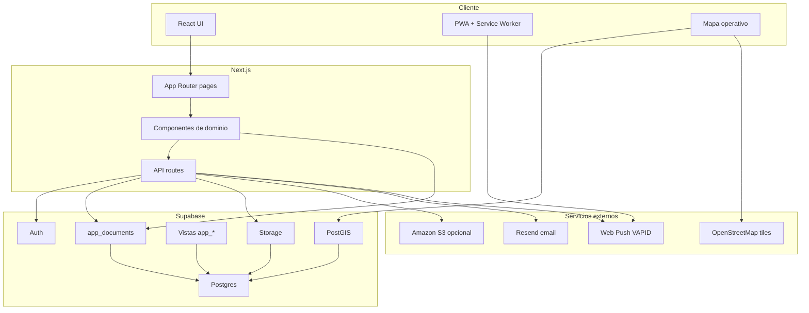

# Arquitectura de Pixel Project

Pixel Project es una aplicación Next.js orientada a gestión inteligente de proyectos. Combina módulos operativos, financieros, espaciales y de talento humano sobre una base Supabase.

## Vista general

## Capas

### Presentación

- `app/`: páginas, layouts y API routes de Next.js.
- `components/layout/`: estructura de navegación, sidebar y contenedores.
- `components/ui/`: componentes base reutilizables.
- `components/dashboard/`: dashboard, bandeja y calendario personal.
- `components/projects/`: módulos funcionales de cada proyecto.

### Dominio

- `lib/task-title.ts`: normalización y presentación de títulos de tareas.
- `lib/taskProgress.ts`: cálculo de avance.
- `lib/workflow-routing.ts`: rutas condicionales de workflows.
- `lib/workflow-schedule.ts`: programación de pasos y duración.
- `lib/incremental-rate-tasks.ts`: lógica de tareas incrementales.
- `lib/rate-card-config.ts`: configuración de rate cards.
- `lib/permissions.ts`: reglas funcionales de permisos.
- `lib/project-access.ts`: acceso por rol, organización y proyecto.

### Persistencia

Pixel Project usa `app_documents` como almacén documental sobre Postgres. Cada documento se identifica por:

- `collection_path`: colección lógica, por ejemplo `projects`, `users`, `tasks`.
- `doc_id`: identificador del documento.
- `data`: payload JSONB.

Esto permite mantener una API parecida a documentos mientras se aprovechan Postgres, RLS, vistas y PostGIS.

### Supabase

- Auth: inicio de sesión, recuperación, invitaciones y usuarios.
- Postgres: `app_documents`, vistas `app_*`, funciones RLS y tablas espaciales.
- Storage: archivos de proyecto, documentos, fotos de inventario y perfiles cuando se usa el proveedor Supabase.
- Realtime: sincronización de documentos y capas espaciales cuando aplica.
- PostGIS: geometrías, capas, anotaciones, uniones con tareas y simulación temporal.

### Integraciones

- Amazon S3: proveedor documental opcional para archivos pesados. Next.js genera URLs temporales de carga/descarga y guarda metadatos en `app_documents`.
- Resend: correos transaccionales con plantillas HTML.
- Web Push: notificaciones PWA mediante VAPID.
- OpenStreetMap: mapa base para visualización espacial.

## Módulos funcionales

### Tareas

Gestiona tareas por estado, cuantitativas, reuniones, subtareas y workflows. Las tareas se pueden agrupar visualmente, buscar, ocultar si están finalizadas y analizar con indicadores.

### Workflows

Hay dos enfoques:

- Workflow lineal: pasos secuenciales con formularios, responsables, calidad y rate cards.
- Workflow variable: pasos conectados por rutas condicionales, decisiones y caminos no lineales.

El editor visual fullscreen permite ubicar nodos, configurar formularios y guardar la vista del flujo.

### Calidad

Registra aceptaciones, devoluciones, causales, comentarios, trazabilidad, estadísticas y reportes por proyecto o globales.

### Rate cards

Mide producción, costos e ingresos operativos estimados. Puede trabajar con unidades o valores monetarios y asociarse a profesionales, tareas, subtareas, formularios y presupuesto.

### Presupuesto

Permite crear líneas macro y piezas presupuestales. Cada pieza puede tener tipo, responsable, cantidad, tiempo, factor, valor unitario, meses activos y relación con personas o costos.

### Facturación

Separa lo operativo estimado de la realidad financiera. Las facturas representan ingresos reales y los pagos representan costos reales. Se pueden vincular a líneas y piezas presupuestales.

### Inventario

Administra activos por proyecto y globalmente: categoría, responsable, fotos, ubicación, coordenadas, estado, traslados, bajas, reparaciones y hoja de vida.

### Mapa operativo

Permite subir capas, gestionar simbología, etiquetas, atributos, anotaciones, uniones con tareas, estadísticas por área y simulación temporal del avance.

### Talento humano

Cruza personas, roles, proyectos, cobertura presupuestal, invitados, desempeño, calidad, carga operativa y señales administrativas.

## Seguridad y privacidad

- Las claves reales viven en variables de entorno.
- `.env*` está ignorado, salvo `.env.example`.
- `SUPABASE_SERVICE_ROLE_KEY`, `RESEND_API_KEY` y `WEB_PUSH_PRIVATE_KEY` solo deben existir en servidor.
- `AWS_ACCESS_KEY_ID` y `AWS_SECRET_ACCESS_KEY` son server-only y se configuran en Vercel, nunca en el panel ni con prefijo `NEXT_PUBLIC_`.
- Los administradores bootstrap se configuran con `BOOTSTRAP_ADMIN_EMAILS` y `NEXT_PUBLIC_BOOTSTRAP_ADMIN_EMAILS`.
- Las migraciones públicas usan placeholders y `app.bootstrap_admin_email`.

## Convenciones de datos

- Colecciones documentales: plural en inglés o dominio heredado (`projects`, `tasks`, `users`, `team_members`).
- Fechas: ISO strings o timestamps compatibles con Supabase.
- Roles: `admin`, `org_admin`, `manager`, `coordinador`, `administrativo`, `user`.
- Módulos con permisos: tareas, presupuesto, inventario, facturación, calidad, mapas y talento humano.

## Puntos de extensión

- Nuevos módulos de proyecto: agregar componente en `components/projects/` y tab en `app/projects/[id]/page.tsx`.
- Nuevas colecciones: usar `lib/supabase/document-store.ts`.
- Nuevos proveedores de archivos: implementar adaptador compatible con `lib/supabase/storage-shim.ts` y rutas server en `app/api/storage`.
- Nuevas vistas SQL: agregar migración en `supabase/migrations`.
- Nuevos reportes: preferir agregación en memoria para vistas pequeñas y vistas SQL para tableros pesados.
- Nuevas notificaciones: usar `lib/notifications.ts`, API routes en `app/api/notifications` y plantillas en `lib/email`.
